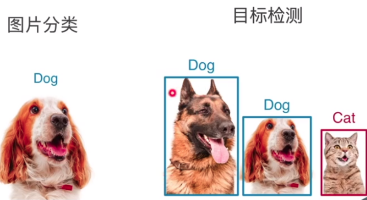
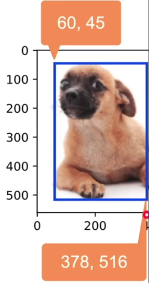
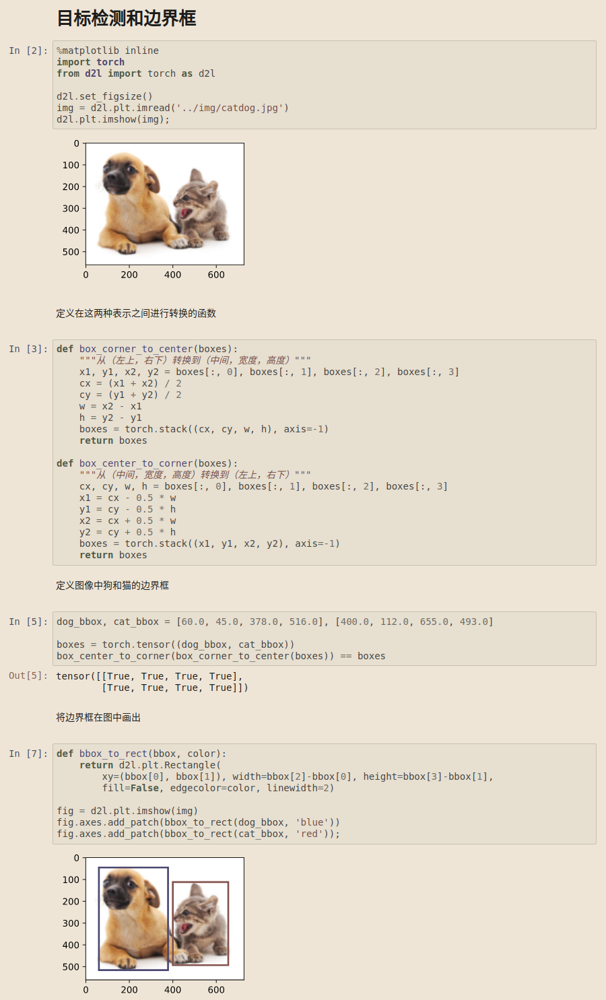
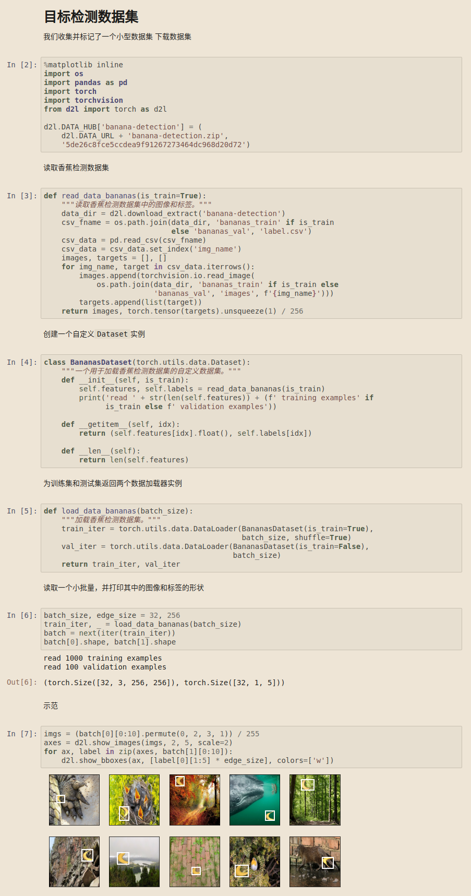

> 
>
> 图像分类：在一个图片中将**一个实体**找出来
>
> 目标检测：在一张图片中识别**所有感兴趣的物体**
>
> * 并将每个物体的具体位置标记出来

##### 边缘框

* 4个数字定义
  * (左上x,左上y,右下x,右下y)
  * (左上x,左上y,宽,高)
  * 

##### 数据集

* 每行表示一个物体
  * 图片文件名，物体类别，边缘框
* COCO(`cocodataset.org`)
  * 80个物体，`330k`图片，`1.5M`物体

##### 总结

* 物体检测识别图片中多个物体的类别和位置
* 位置通常用边缘框表示

> 实现
>
> 
>
> * 数据集
>   * 

