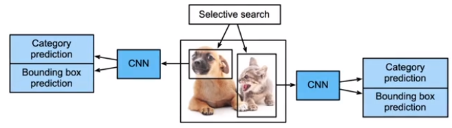
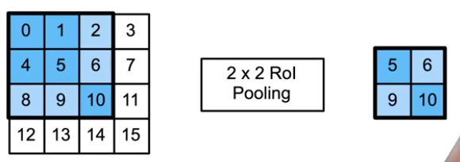
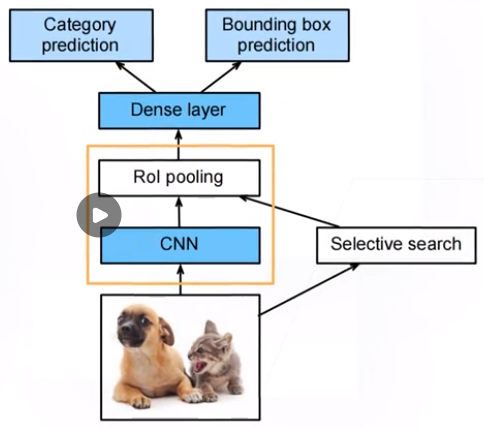
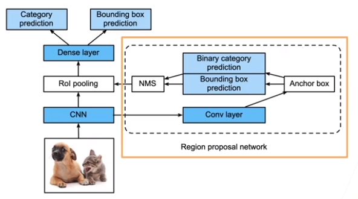
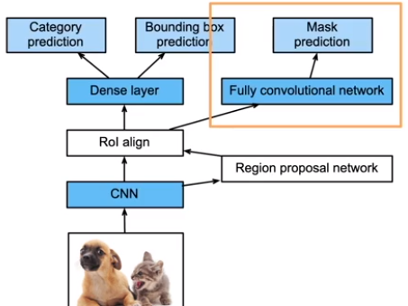

##### R-CNN Region-Based 基于区域的CNN

* 启发式搜索算法来选择锚框

  * 每个锚框当做一张图片
  * 怎么让每个锚框大小一样，变成batch方便训练呢？

* 预训练模型来对每个锚框抽取特征

  使用预训练模型对每个锚框抽取特征

  * 这里使用`CNN`来抽取特征

* 训练一个`SVM`来进行类别分类

* 训练一个线性回归模型来预测**边缘框偏移**

---

###### 兴趣区域（`Rol`）池化层

* 给定一个锚框，均匀分成`nxm`块，输出每块中的最大值
* 不管锚框多大，总是输出`nm`个值

----

##### 经典模型 `Fast RCNN`

* 主要改进
  * 对一张图片用`CNN`抽特征（对整张图片，而不是对一张图片的每个锚框）
  * `#thread1` 在特征图上抽取锚框
    * 选择性的搜索
  * `#thread2` 在原图上进行抽取锚框
  * `#main` 将搜索到的锚框映射到特征图上
    * 在特征图上按照比例找出来
  * 对特征图上的每个锚框使用`Rol pooling`放缩成一样大小
    * 图中黄框中，将一个图片（假设有`100`个锚框）
    * 变成`100x4`的一个向量（`4`是因为使用`2x2`的`rol pooling`）
  * 接着放入全连接层
    * 对100个样本进行预测

##### `Faster R-CNN`

* 使用一个**区域提议网络**来替代启发式搜索获得**更好的锚框**
* 主要改进
  * 在`CNN`对图片进行特征抽取后，将特征图输入`RPN`，输出高质量锚框
    * 保留一些好图
  * `2Stage`
    * 先做超一点的预测
    * 再做大的模型预测

##### Mask R-CNN

* 如果有**像素级别的标号**，使用`FCN`来利用这些信息（`todo` 语义分割）
* `Rol Pooling --> Rol align`
  * 锚框对齐，在像素级别会出现问题，带来误差，导致在边界时预测不准

##### 总结

* `R-CNN`最早、最有名的一类基于锚框和`CNN`的目标检测算法
* `Fast/Faster R-CNN`持续提升性能
* `Faster R-CNN`和`Mask R-CNN`在要求高精度场景的常用算法
  * 无人车