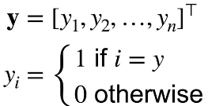
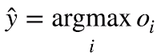
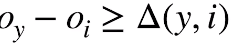
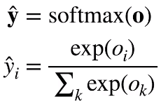
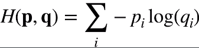
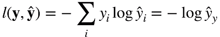
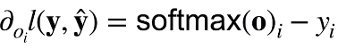

* 回归 vs 分类

  * 回归估计一个连续值
  * 分类预测一个离散类别
    * mnist：手写数字识别（10类）
    * ImageNet：自然物体分类（1000类）

* 从回归到多类分类 均方损失

  * 回归

    * 单连续值输出
    * 自然区间R
    * 跟真实值区别作为损失

  * 分类

    * 通常多个输出
    * 输出i是预测为第i类的置信度

  * from 回归 to 多类分类 -- 无校验比例

    * 对类别进行一位有效编码 one-hot
      * 
    * 使用均方损失训练
    * 最大值 作为预测
      * 
    * 需要正确类别的置信度远远大于非正确置信度
      * 

  * from 回归 to 多类分类  --  校验比例

    * 输出匹配概率（非负，和为1）
      * 
    * 概率 **y** 和 **y^** 的区别作为损失
      * 真实数值y也是概率（one-hot编码，只有一个为1，其他都为0）

  * Softmax和交叉熵损失

    * 交叉熵用来衡量两个概率的区别  

    * 将它作为损失

      * 
        * 对于真实类别预测值求log然后取负数
        * 对分类问题不关心非正确类的预测值

    * 其梯度是真实概率和预测概率的区别

      * 

        

* 总结
  * softmax回归是一个多类分类模型
  * 使用softmax操作子得到每个类的预测置信度
  * 使用交叉熵来衡量预测和标号的区别