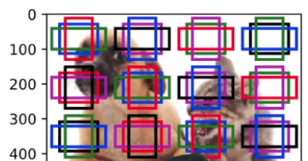
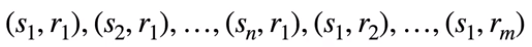
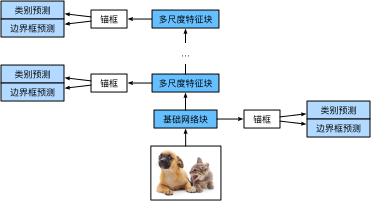

> 针对`R-CNN`的两次预测，`SSD`只进行读取一次，进行多次取框

##### 生成锚框

* 对每个像素，生成**多个以它为中心的锚框**
* 给定n个大小`s1、s2、...sn`和m个高宽比，生成`n+m-1`个锚框，其大小和高宽比为
  * 大小s也就是占整张图的比例，也就能确定锚框的像素个数；高宽比则能确定锚框的形状
  * 

##### `SSD`模型

* 一个基础网络（`VGG`、`ResNet`）抽取特征，多个卷积层块减半高宽
* 每段都生成锚框
  * 底部段拟合小物体，顶部段拟合大物体（多尺度）
    * 底部段基于该特征图生成的锚框数量较多，可以用来检测尺寸较小的目标
    * 每个多尺度特征块将上一层提供的**特征图的高和宽缩小（如减半）**，并使特征图中每个单元在输入图像上的感受野变得更广阔
      * 越靠近顶部的多尺度特征块输出的**特征图越小**，故而基于特征图生成的锚框也越少，加之特征图中每个单元感受野越大，因此更适合检测**尺寸较大**的目标
* 对每个锚框预测类别和边缘框

> * 图片进来，先使用`CNN`抽取特征
>   * 输入特征图生成锚框，进行预测
>   * 综合多次结果

##### 总结

* 通过单神经网络来检测模型
* 以每个像素为中心的产生多个锚框
* 在多个段的输出上进行多尺度的检测

[Ref](https://zh.d2l.ai/chapter_computer-vision/ssd.html)

