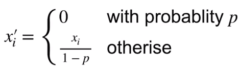

* 动机
  * 好的模型需要对输入数据的扰动鲁棒（加入噪音仍然能够识别）
    * 使用有噪音的数据等价于Tikhonov正则（正则==Penalty或Regular Expression）
    * 丢弃法：在层之间加入噪音
* 无偏差加入噪音 希望期望不变
  * 对x加入噪音得到x'，希望E[x']=x
  * 丢弃法对每个元素进行以下扰动
    * 
      * 
* 使用丢弃法
  * 通常作用于隐藏全连接层的输出上
    * 
    * 
* 推理中的丢弃法（预测过程）
  * 正则项只在训练中使用：影响模型参数的更新
    * 预测时，参数不需要改变，那就不需要正则项
  * 推理过程中，丢弃法直接返回输入h=dropout（h）
    * 这样也能保证确定性的输出

* 总结
  * 丢弃法将一些输出项随机置0来控制模型复杂度
  * 作用于多层感知机的隐藏层输出上
    * 丢弃概率是控制模型复杂度的超参数

