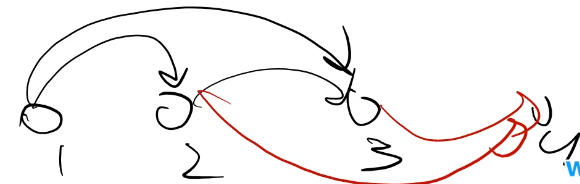
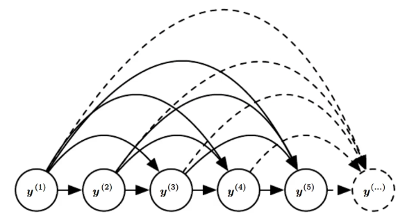
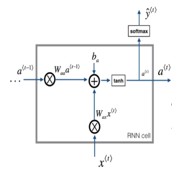
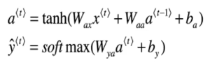
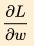

##### 例子：语言概率模型

* 根据之前的话，预测后面要说的话
* 
  * 输入字母转化为向量
  * 向量输入到隐层中   x -(Whx)-> h -(Whh)-> h
  * 预测y向量    why
    * 通过损失函数训练模型，计算MSE（最小平方误差），梯度下降训练改变矩阵w，b

> 之前的语言概率模型
>
> * N-Gram model类似马尔可夫链（强烈的假设）
>   * bi-gram
>     * 上一个对下一个**产生影响**
>     * 根据**条件概率**，求两个单词同时出现**联合概率**
>   * tri-gram
>     * 前两个对应下一个
>     * 
>     * **概率图模型**
>       * 1由自己决定，2由1决定，3由1、2决定，4由2、3决定

##### RNN要求的概率P(y)

* 下一个字母可能出现的概率（取最大值）
  * 还是基于概率向量
* 与**n-gram概率图的关系**
  * 
  * **之前所有出现过的字母，共同作用于当前字母**
    * 相当于n==∞

##### RNN过程

* 
  * 
* 输入当前状态和上一刻隐层输出
* 通过tanh得到一个本层输出at和一个softmax（数值-->概率）P（y）

---

##### RNN的求解与训练

* 难点：**时间变得很长，训练过程也会变得很长**
  * **反向传播（从终点向起点传播）**
    * h影响了y、下一时刻h
      * **受到h2影响的h3、y2要反向传播到h2**
      * 继续向前回传到影响了h2的前面因子
      * 具体过程略过

* **BPTT**：穿越时间的BP

  * 

  * BP == **算出参数梯度**并**更新参数**

    * 参数梯度 == 损失函数对参数的偏导数，参数更新公式：w=w-α，α是学习率
    * 只需求出

  * 步骤

    * 定义损失函数

      * 假设时刻`t`时刻的损失函数为：
        $$
        L_t=\frac{1}{2}\left(Y_3-O_3\right)^2
        $$

      * 损失函数形式不重要，这里假设为均方差

      * 存在多个时刻，总损失函数为**所有时刻的损失函数之和**：
        $$
        L=\sum_{t=0}^TL_t   \tag{1}
        $$

    * 求损失函数对参数的偏导

      * `w`在每个时刻都出现，所以`w`在时刻`t`的梯度 = 时刻`t`的损失函数对**所有时刻**的`w`的**梯度和**：
        $$
        \partial \frac{L_t}{w} = \sum_{s=0}^{T}\frac{L_t}{W_s} \tag{2}
        $$

      * 将`（2）`代入`（1）`即可得到下面结果，`w`的总梯度等于`w`在**所有时刻**的和：
        $$
        \partial \frac{L}{w} = \sum_{t=0}^{T}\partial \frac{L_t}{w}
        =\sum_{t=0}^{T}\sum_{s=0}^{T}\partial \frac{L_t}{w_s}
        $$

    * 更新参数

      * 
        $$
        w = w-α\partial \frac{L}{w}
        $$

* 梯度消失

  * 前向传播公式，其中`f`是函数，`g`是softmax函数

    * $$
      {s_t=f(Ux_t+Ws_{t-1}+b)}\\
       {o_t=g(Vs_t+c)}
      $$

  * 

