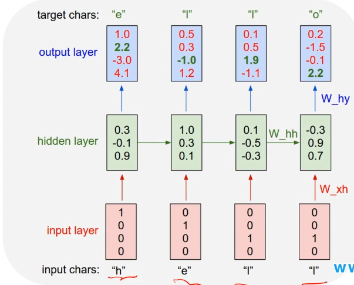

##### 例子：语言概率模型

* 根据之前的话，预测后面要说的话
* 
  * 输入字母转化为向量
  * 向量输入到隐层中   x -(Whx)-> h -(Whh)-> h
  * 预测y向量    why
    * 通过损失函数训练模型，计算MSE（最小平方误差），梯度下降训练改变矩阵w，b

> 之前的语言概率模型
>
> * N-Gram model类似马尔可夫链
>   * bi-gram
>     * 上一个对下一个产生影响
>     * 根据条件概率，求联合概率
>   * tri-gram
>     * 前两个对应下一个

