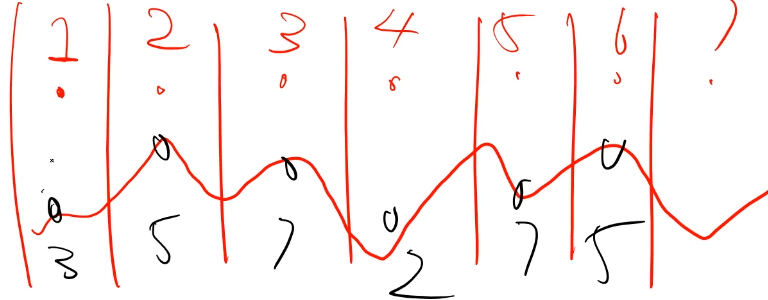
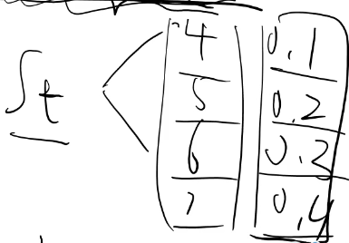
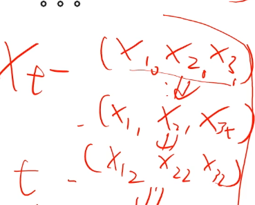
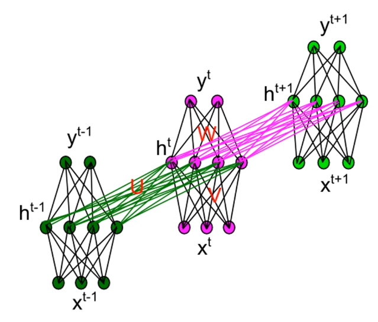
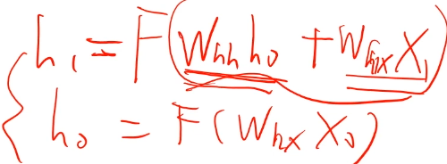
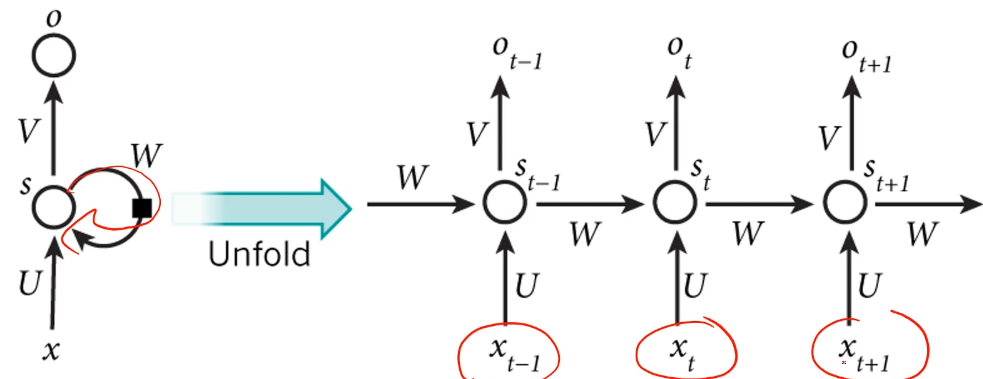
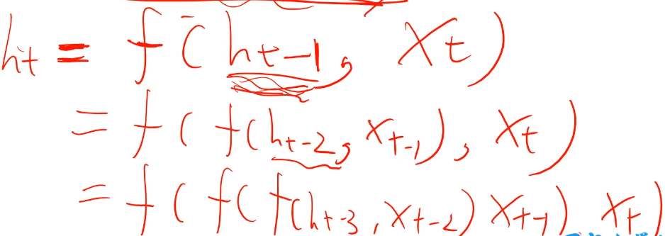

##### 循环神经网络 RNN

* 序列处理器   --    第一个层次
  * 针对**时间序列**的数据
    * 说话的句子(随着时间演进，有一个向量)
    * 股票价格
    * 视频
  * 与**表格数据**区别
    * 不定长
    * 动态

##### 建模时间序列

> 马尔可夫链
>
> * 存在一个时间链（第一天，第二天，第三天），使其离散化
>   * 
> * 思考时间点t到时间点t+1的变化
>   * t时刻状态st，t+1时刻状态
>   * P(st+1 | st) 
>   * st+1只跟st有关  非常强的假设
>     * 

* 假设过于简单
  * **现在时刻状态**应该与**过往任何时刻都有关系**

##### RNN

* 增加隐层到隐层的连接 Whh
  * 输入时间序列
    * 每行之间都有一个δt的时间间隔，
  * 
    * 第一个多层感知机输入x10，x20，x30  一个词向量，表示一个单词
    * 第二个多层感知机输入x11，x21，x31
    * 第三个多层感知机输入x12，x22，x32
  * 将上一个多层感知机输入xt-1的经过该隐层输出ht-1传递到下一个多层感知机的隐层和该多层感知机输入xt一起输入给ht
    * 第t个多层感知机的输入是ht-1+xt 
    * Whh 将ht-1传递到ht使用 Wxh 将x映射到h
    * ht = F（Whh ht-1 + Wxh xt）
    * 
  * 最终有三个时间序列
    * 输入时间序列x，隐藏层输出h（记忆体，联系体），输出时间序列y（针对每一个时刻预测下一时输出）

##### RNN的两种表达形式

* W不会随时间变化
  * 时间上权值共享 
  * 时间平移不变性
    * 不同时间点，使用同样的参数
    * 世界的规律不随时间变化
* 随着**时间长度**延伸**网络长度**

###### 隐层包含信息

* ht = G（x1，x2，x3，....，xt）
  * 当下节点隐藏层状态 包含整个x时间序列历史
  * 整个输入历史，决定当下状态
  * 佟湘玉

