* 感知机
  * 给定输入x，权重w和偏移b，感知机输出：
    * 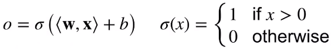
    * x,w都是向量，多输入，单输出
    * 二分类：-1或1
      * Vs.回归输出实数
      * Vs.Softmax回归输出概率
  * 训练感知机
    * 初始化 w=0 and b=0
    * 对一个样本i从0到最后
      * if yi [<w,xi> + b] <= 0 then   # 这个样本预测错误
        * 对w进行一次更新 w+yixi and b+yi
      * 当所有元素都分类正确结束循环（所有元素都是>0）
    * 等价于使用批量大小为1的梯度下降，使用如下的损失函数
      * 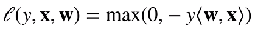
        * max（0）这里对应if语句，当分类正确时，这里的y[w,x]>0
        * 那这里就输出为0，梯度就不更新
        * 分类错误时候，y[w,x]为负数，然后损失函数为正数。更新梯度
    * 收敛定理（什么时候会停）
      * 数据都在半径r内
      * 余量ρ分类两类
        * 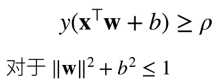
        * 感知机保证在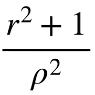步骤后收敛
          * r数据大小（数据量很大，收敛速度变慢）
          * ρ数据很好（分割面大小，越大越好找）
  * 感知机问题
    * 不能拟合XOR函数，只能产生线性分割面
      * 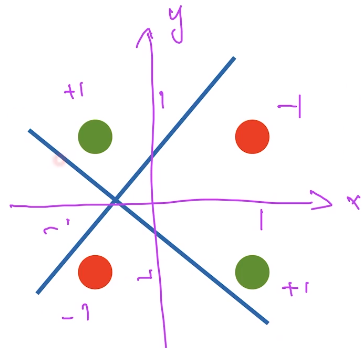

---

* 多层感知机
  * XOR问题
    * 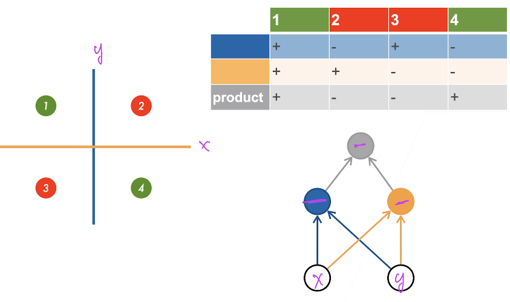
    * 用两个函数组合实现
      * 找到两个简单的线，组合分割面
  * 单隐藏层
    * 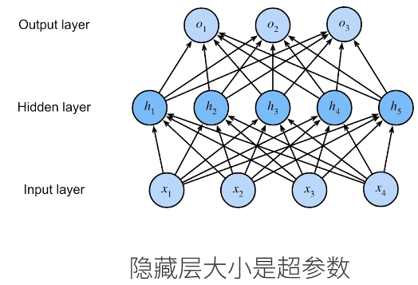
      * 输入层大小无法改变，数据多少是固定的；
      * 输出层大小无法改变，分类问题多少个类是固定；
    * 单分类
      * 输入x∈R^n(n维向量)
      * 隐藏层W1∈R^(mxn),b1∈R^m（假设隐藏层大小m）
        * m个隐藏层，每个向量有n长度的权重（对应输入层n维），偏置则是m个
      * 输出层w2∈R^m,b2∈R（单分类，只输出一个，结构就是一个长为m的向量）
        * 隐藏层输出长度为m的向量
      * 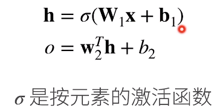
* 激活函数
  * 如果还是线性模型，那么累计起来还是线性的。
  * sigmoid激活函数
    * 将输入投影到（0，1），是一个软的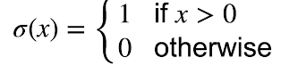
      * 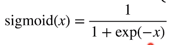
      * 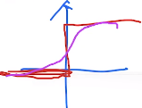
  * Tanh激活函数
    * 将输入投影到（-1，1）
      * 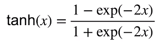
      * 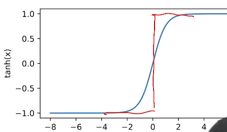
  * ReLU激活函数
    * ReLU:rectified linear unit
      * 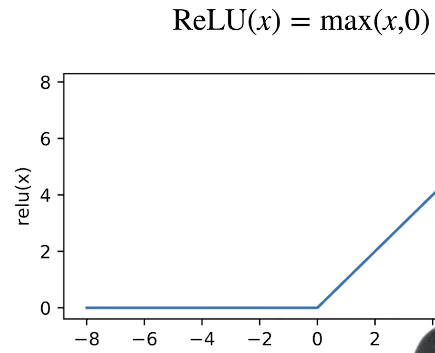
    * 计算快

---

* 多类分类
  * 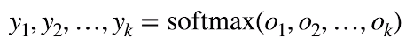
    * softmax（将所有的输入拉到0-1的区域，使得y1加到yn为1）
  * 
  * 结构
    * 输入x∈R^n
    * 隐藏层W1∈R^mn,b1∈R^m
    * 输出层W2∈R^mk,b2∈R^k
      * 输出变成了k个单元
      * 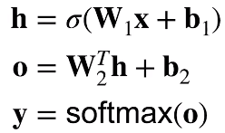
    * 多隐藏层
      * 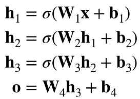
      * 超参数
        * 隐藏层数
        * 每层隐藏层的大小

