* 如何让训练更加稳定
  * 目标：让梯度值在合理范围
    * [1e-6,1e3]
  * 将乘法变加法
    * ResNet，LSTM
  * 归一化 X~N(0,1)
    * 梯度归一化，梯度裁剪
  * 合理的权重初始和激活函数 √

---

* 让每层的方差都是一个常数
  * 将每层输出和梯度都看做随机变量
  * 让均值和方差都保持一致
    * 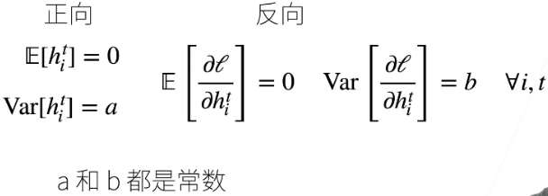
    * 要达到每层输出和梯度都是一样均值方差的方法
      * 权重初始化
        * 在合理值区间里随机初始参数
        * 在训练开始时更容易有数值不稳定
          * 
          * 远离最优解地方损失函数表面可能很复杂
          * 最优解附近表面会比较平
        * 使用N（0，0.01）来初始可能对小网络没问题，但是不能保证深度神经网络
        * eg：MLP
          * 假设
            * 权重是独立同分布
            * 这层的输入独立于当前层的权重
            * 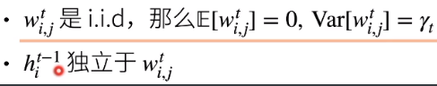
          * 假设没有激活函数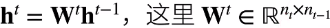
            * 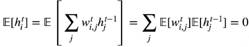
            * 正向方差
              * n个项的平方可以写作每个项平方加上交叉项
              * 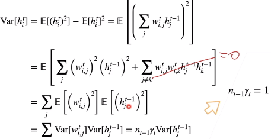
            * 反向均值和方差
              * 跟正向类似
                * 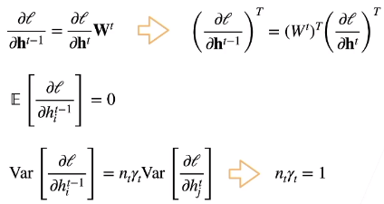
              * 要方差一致需要满足两个条件
                * 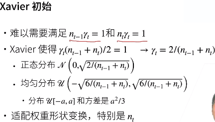
                  * nt-1和nt无法满足相等
                    * 满足一个更小的范围 第二行
                  * γt是t层权重的方差
                  * 权重初始化时方差是根据输入输出决定
          * 假设有线性激活函数
            * 假设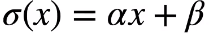
              * 想让均值为0，方差为固定数
              * 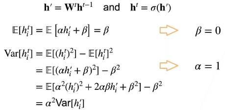
            * 反向
              * 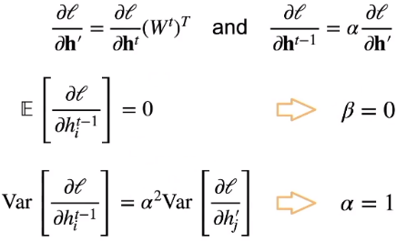
        * 检查常用激活函数
          * 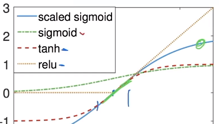
          * 使用泰勒展开
            * 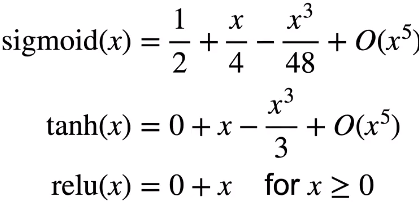
              * 下面两个满足在零点附近  满足之前N（0，0.01）的要求
          * 调整sigmoid：
            * 4xsigmoid(x) - 2
* 总结
  * 合理的权重初始值和激活函数的选取可以提升数值稳定性

