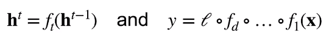
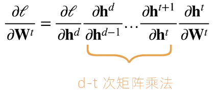
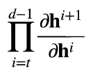
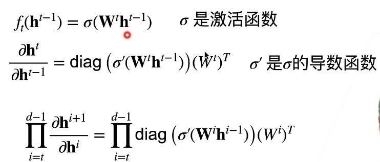
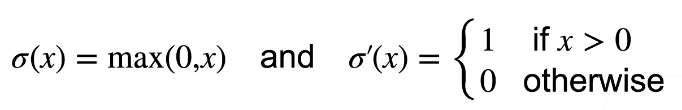
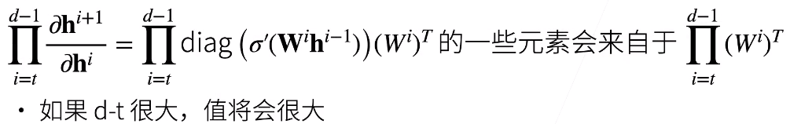
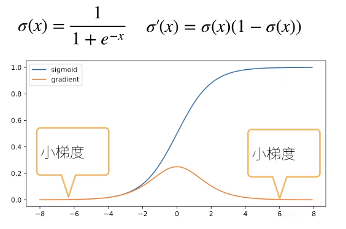
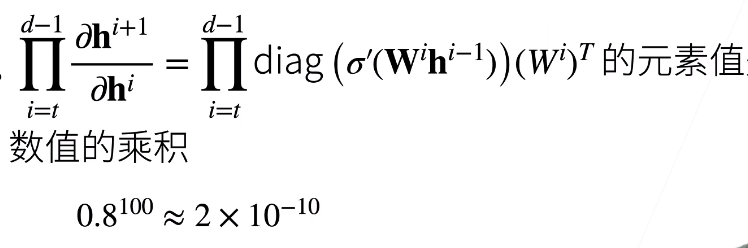

* 神经网络的梯度
  * 考虑如下有d层的神经网络
    * 
      * ht-1是t-1层的隐藏层的输出，再经过一个ft得到第t层的输出ht
  * 计算损失l关于参数Wt的梯度
    * 
      * 进行了太多次矩阵乘法
      * 数值不稳定
* 数值稳定性的常见问题  
  * 梯度爆炸	1.5^100=4x10^17
  * 梯度消失    0.8^100=2x10^(-10)
  * 例子：MLP
    * 加入如下MLP（省略偏移）
      * 
        * diag对角矩阵
        * 梯度爆炸
          * ReLU作为激活函数
          * 
            * 使用ReLU之后对角矩阵中会出现很多01，要么把某一列留住，要么全是0
          * 问题
            * 值域超出范围
            * 对学习率敏感
              * 学习率太大->大参数值->更大的梯度
              * 学习率太小->训练无进展
              * 需要不断调整学习率
        * 梯度消失
          * 使用sigmod作为激活函数
          * 
          * 当输入层数较多，那么对角矩阵那里就会变得很小（导数如上图）
          * 
          * 问题
            * 梯度值为0
            * 训练无进展
              * 不管怎么选择学习率
            * 对于底部层（靠数据较近层）尤为严重
              * 仅仅对顶部层训练的好
              * 无法让NN更深
* 总结
  * 当数值过大或者过小时会导致数值问题
  * 常常发生在深度模型中，因为其会对n个数累乘

