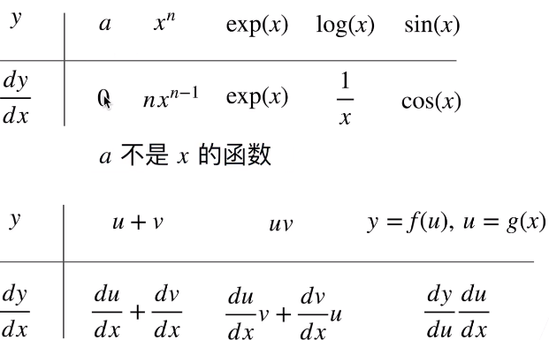
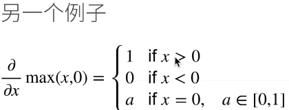
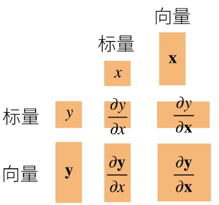
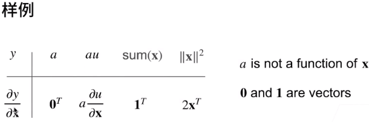
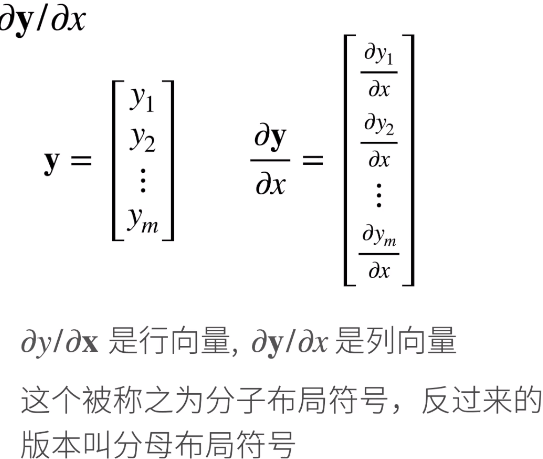
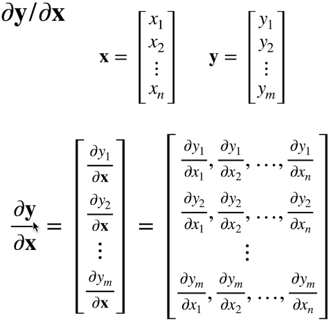
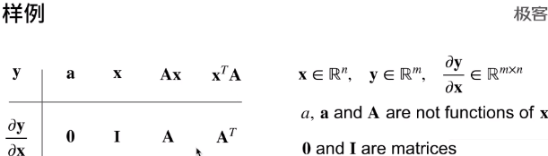
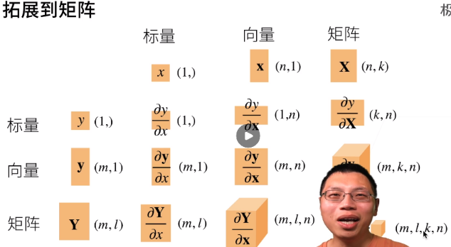

#### 所有的优化模型的求解都通过求导

* 标量导数
  * 
  * 导数是切线的斜率
* 亚导数 将导数拓展到不可微的函数
  * 
  * 
* 梯度  将导数拓展到向量
  * 
    * 形状要确定
  * 
    * y是标量，x是列向量
    * 标量关于列向量的导数 == 行向量
    * 
      * 梯度跟等高线正交，梯度指向值变化最大的方向（往大值走）
    * 
    * 
      * ||x|| 范数   <u,v> 内积
  * 
  * 
    * 
    * 
  * 

