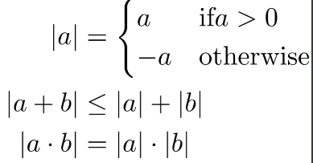
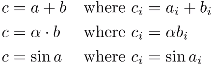
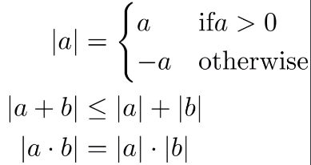
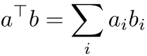
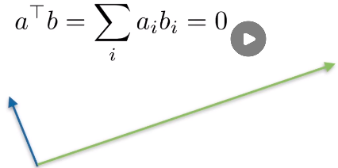
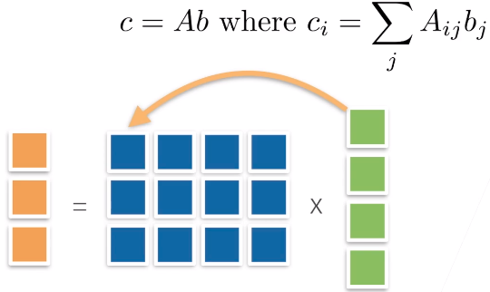
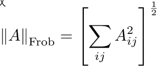
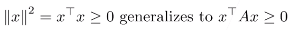
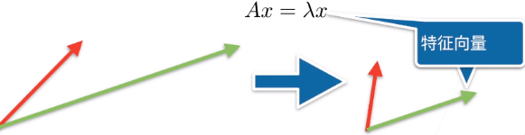

#### 标量

* 简单操作
  * c = a + b
  * c = ab
  * c = sin a
* 长度
  * 

#### 向量

* 简单操作
  * 
* 长度
  * 
  * 点乘 
    * 
  * 正交
    * 

* 矩阵
  * 简单操作
    * C=A+B  每个元素相加
    * C=αB     标量乘以每个元素
    * C=sinA  每个元素求sin
  * 乘法 矩阵乘以向量
    * 
    * 扭曲空间
      * 向量通过乘以一个矩阵 变成另一个向量
  * 乘法 矩阵乘以矩阵
    * C= AB where Cik = ∑AijBjk
  * 范数 矩阵的长度
    * c = Ab hence |c| <= ||A|| ||b||
    * 取决于如何衡量b和c的长度
      * ||A|| A的范数和b的范数
    * 常见范数
      * 矩阵范数：最小的满足以上公式的值
      * Frobenius范数
      * 
        * 将矩阵拉成一个向量，然后做向量的范数
  * 特殊矩阵
    * 对称和反对称
      * Aij = Aji and Aij = -Aji
    * 正定
      * 乘以任何一个列向量或一个行向量都>=0
      * 
    * 正交矩阵
      * 所有行相互正交
      * 所有行都有单位长度
      * 可以写成UUT=1
    * 置换矩阵
      * P where Pij = 1 if and only if j=pi(i)
      * 置换矩阵是正交矩阵
  * 特征向量和特征值
    * 不被矩阵改变方向的向量
      * 
    * 对称矩阵总是可以找到特征向量

#### 按照特定轴来求和

```python
shape[5,4]
# 行数为5，列数为4
# 有两个维度 [0,1] 0代表行增加方向，1表示列增加方向 
axis=0,sum[4]
axis=1,sum[5]

# 维度推广
shape [2,5,4]
axis=1 [1,4]
axis=2 [2,5]  去掉中间那个维度
# 按照多个维度求和
axis=[1,2] [4]

# keepdims=True 不会把维度去掉，而是把那里变成1
shape [2,5,4]
axis=1 [2,1,4]
axis=[1,2] [2,1,1]
```

