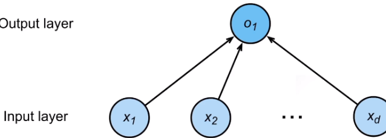

#### 美国买房

* 给标价，需要自己预估价格
* 简化模型
  * 假设1：特征为卧室个数，卫生间个数和居住面积，x1，x2，x3
  * 假设2：成交价格是关键因素的加权和
    * y=w1x1+w2x2+w3x3+b
  * 权重和偏差的实际值在后面决定
* 线性模型
  * 给定n维输入 **x** =[x1,x2,...,xn]T
  * 线性模型有一个n维权重和一个标量偏差
    * **w** = [w1,w2,...,wn]T,b
  * 输出是输入的加权和
    * y=w1x1+w2x2+...+w3x3+b
  * 向量版本
    * y=<**w**,**x**>+b
* 线性模型可以看做单层神经网络 带权重的层数为1
  * 
    * 权重和输入层放在一起，输出层不当层
* 衡量预测质量
  * 比较真实值和预估值，例如房屋售价和估计值
  * 假设y是真实值，y^是预估值，比较平方损失
    * 
* 训练数据
  * 收集数据点来决定参数值（权重和偏差），例如过去6个月卖的房子
  * 通常越多越好
  * 假设有n个样本，记录
  * 
* 参数学习
  * 训练损失
    * 
  * 最小化损失来学习参数
    * 
  * 显示解
    * 将偏差加入权重 
      * 
    * 损失是凸函数，最优解满足
      * 
      * 唯一一个有最优解的模型
* 总结
  * 

