#### 向量链式法则

* 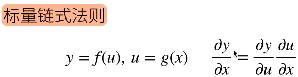
* 拓展到向量  形状最重要
  * 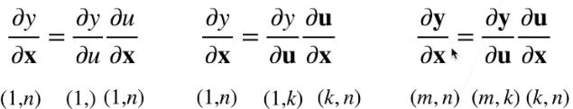
  * 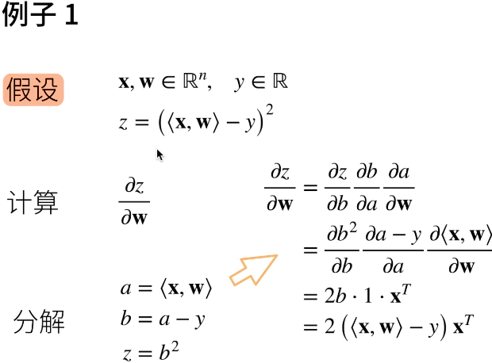
  * 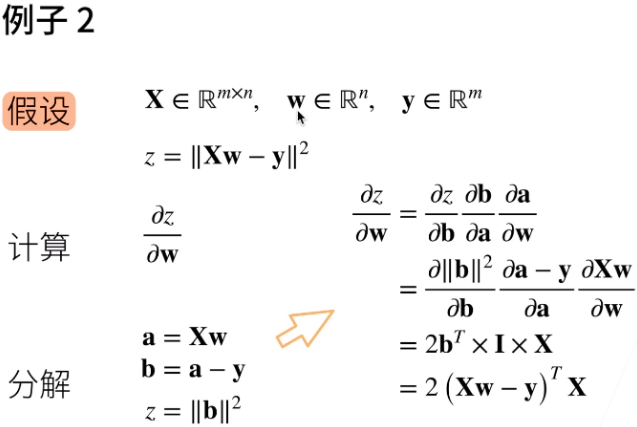

---

#### 自动求导

* 自动求导计算一个函数在指定值上的函数
* 有别于
  * 符号求导  给函数，求导  显式求导
    * 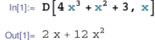
  * 数值求导   不知道f(x) 通过数值拟合导数
    * 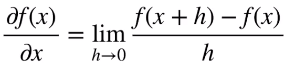
* 计算图
  * 将代码分解成操作子    类似样例，分解步骤
  * 将计算表示成一个无环图
    * 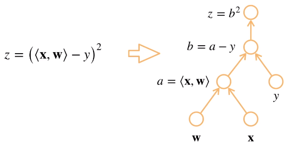
  * 显示构造
    * Tensorflow/Theano/MXNet
    * 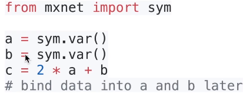
    * 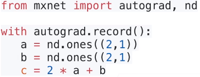
      * 也可以隐式构造，告诉它，要隐藏构造，然后将所有的计算记录下来
  * 隐示构造
    * PyTorch/MXNet
* 自动求导的两种模式
  * 链式法则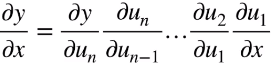
  * 正向积累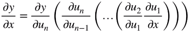
  * 反向累计（反向传递）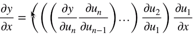
* 反向传递
  * 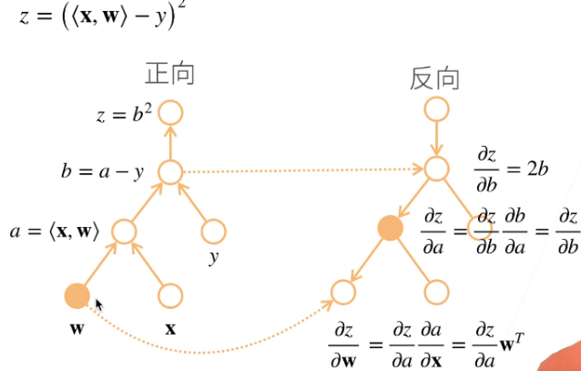
  * 步骤
    * 构造计算图
    * 前向：执行图，存储中间结果
    * 反向：从相反方向执行图
      * 去除不需要的枝
      * 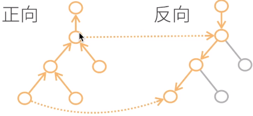
  * 复杂度
    * 计算复杂度：O(n)，n是操作子个数
      * 通常正向和反向的代价类似
    * 内存复杂度：O(n)，需要存储正向的所有中间结果
    * 跟正向累计对比
      * O（n）计算复杂度用来计算一个变量的梯度
        * 每次都需要扫一遍操作树
      * O（n）内存复杂度

