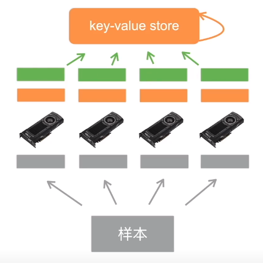

#### 单机多卡并行

* 一台机器可安装多GPU（1-16）
* 训练和预测时，将一个小批量计算切分到多个GPU上达到加速目的
* 常用切分方案
  * 数据并行  √
  * 模型并行
  * 通道并行（数据+模型并行）

##### 数据并行 vs 模型并行

* 数据并行：将小批量分成n块，每个GPU拿到完整参数计算一块数据的梯度
  * 通常性能更好
* 模型并行：将模型分成n块，每个GPU拿到一块模型计算前向和方向结果
  * 通常用于模型大到单GPU放不下

##### 数据并行过程

* 读取一个数据块
* 拿回参数
* 计算梯度
* 发出梯度
  * 

* 总结
  * 当一个模型能用于单卡计算时，通常使用数据并行拓展到多卡上
  * 模型并行则用于超大模型上