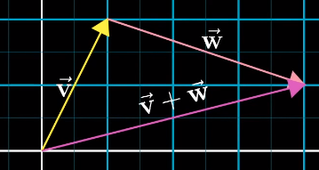
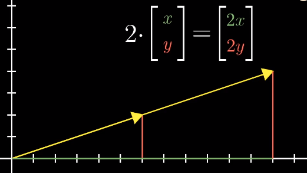
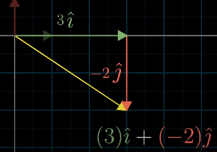

#### 三种观点

* 物理
  * 空间中的箭头
    * 大小与方向
* 计算机
  * 有序的数字列表
* 数学
  * 概括两种观点
    * 向量需保证两个**向量相加**以及**向量相乘**有意义
      * **向量加**和**向量乘**贯穿线性代数始终，起很**重要作用**
      * 比较有深度，to be continued

---

#### 思考向量的方式

* 几何方面	
  * 以**原点**作为**起点**
  * 每个维度的值代表沿着**平行于该轴的方向**走的长度
  * 两种运算
    * 
      * 向量加：唯一允许向量离开原点
      * 实质
        * 先沿着v运动，再沿着w运动 == 沿着两个向量和的运动
    * 缩放
      * 数字 （标量 scalars）用于缩放向量
      * 
      * 将向量中每个分量与标量相乘

---

##### 坐标：一组描述向量的数字

* 考虑每个坐标为一个标量
  * 标量用于缩放（拉伸与压缩）一个向量
  * 
    * **缩放**向量并且**相加**
      * **单位向量的组合**为**坐标系的基**
        * **基向量** == 标量**缩放对象**
        * 用数字描述向量，依赖于使用的基

##### 线性组合：两个数乘向量的和

* 线性？
  * 固定其中一个向量，让另一个向量自由变化，产生向量终点描出一条直线
* 产生空间
  * 两个共线向量 -- 终点落在一条直线上的向量的集合
  * 大部分向量 -- 所有二维向量集合
  * 零向量 -- 原点

##### 点 和 向量

* 向量终点 代表 该向量
  * 考虑落在一条直线上的所有向量
    * 考虑直线本身
  * 考虑所有二维向量
    * 考虑无限大的二维平面本身
* 三维空间的张成空间
  * 

